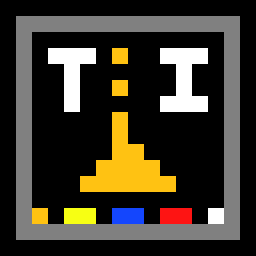

  </img>
  <h1 align="center">Powder-TI</h1>

<h2 align="center"> 🚧🚧 UNDER CONSTRUCTION 🚧🚧</h2>

A TI 84 Plus CE/TI 83 Premium CE port of the popular game The Powder Toy.

Some of the code is taken/insipired from the The Powder Toy's source code at: https://github.com/The-Powder-Toy/The-Powder-Toy

## Building

Meanwhile I write the rest of README.md, here's the instructions to build the project:

You need the [ti-ce toolchain](https://github.com/CE-Programming/toolchain) installed and in PATH.

Make sure to cd into the root of the project.

Now, run `make gfx` to create the graphics headers required.

And then run `make all` to actually build the binary file.

(You can also use `make test` to upload the file to CEmu64 and run it automatically as long as it is in PATH)

To get debug messages in the console, you need to `make clean debug` first, and then you can use `make debug test` to run it with debugging.
